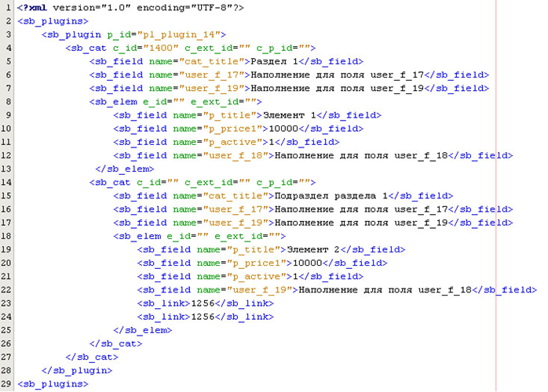
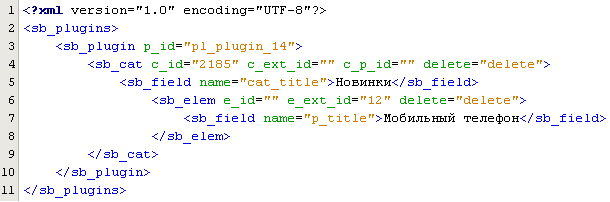

# SBuilder XML SOAP generator

[](https://github.com/Manzadey/sbuilder-xml-soap/actions/workflows/phpunit-tests.yml)

Пакет представляет собой простое API для генерации и выгрузки данных в формате XML в CMS SBuilder.

## Установка

```bash
composer require manzadey/sbuilder-xml-soap
```

## Создание структуры XML файла



```php
use Manzadey\SbuilderXmlSoap\Plugins;
use Manzadey\SbuilderXmlSoap\Plugin;
use Manzadey\SbuilderXmlSoap\Category;
use Manzadey\SbuilderXmlSoap\Field;
use Manzadey\SbuilderXmlSoap\Element;

$plugins = new Plugins;

$plugin14 = new Plugin('pl_plugin_14');

$category1400 = new Category('1400');
$category1400->addField('cat_title', 'Раздел 1');
$category1400->addField(new Field('user_f_17', 'Наполнение для поля user_f_17'));
$category1400->addField(
    static fn(Category $category) : Field => $category
        ->newField('user_f_19', 'Наполнение для поля user_f_19')
);

$element = new Element;
$element->addField('p_title', 'Элемент 1');
$element->addField('p_price1', '10000');
$element->addField('p_active', '1');
$element->addField('user_f_18', 'Наполнение для поля user_f_18');

$category1400->addElement($element);
$category1400->addCategory(
    static fn(Category $category) : Category => $category->newCategory()
        ->addField('cat_title', 'Подраздел раздела 1')
        ->addField('user_f_17', 'Наполнение для поля user_f_17')
        ->addField('user_f_19', 'Наполнение для поля user_f_19')
        ->addElement(static fn(Category $category) : Element => $category
            ->newElement()
            ->addField('p_title', 'Элемент 2')
            ->addField('p_price1', '20000')
            ->addField('p_active', '1')
            ->addField('user_f_18', 'Наполнение для поля user_f_18')
            ->addField(static fn(Element $element) : Field => $element
                ->newField('user_f_4', '5')
                ->extId()
            )
        )
);

$plugin14->addCategory($category1400);
$plugins->addPlugin($plugin14);

echo $plugins->save();
```

## Создание структуры вместе со справочником


```php
use Manzadey\SbuilderXmlSoap\Plugins;
use Manzadey\SbuilderXmlSoap\Plugin;
use Manzadey\SbuilderXmlSoap\Category;
use Manzadey\SbuilderXmlSoap\Field;
use Manzadey\SbuilderXmlSoap\Element;

$plugins = (new Plugins)->addPlugin(
    static fn(Plugins $plugins) : Plugin => $plugins->newPlugin('pl_plugin_14')
        ->addCategory(
            static fn(Plugin $plugin) : Category => $plugin->newCategory()
                ->addField('cat_title', 'Новинки')
                ->addElement(
                    static fn(Category $category) : Element => $category->newElement()
                        ->addField('p_title', 'Мобильный телефон')
                        ->addField('p_price_1', '10000')
                        ->addField(
                            static fn(Element $element) : Field => $element->newField('user_f_22', '4')->extId()
                        )
                )
        )
)->addPlugin(
    static fn(Plugins $plugins) : Plugin => $plugins->newPlugin('pl_sprav')
        ->addCategory(
            static fn(Plugin $plugin) : Category => $plugin->newCategory()
                ->addField('cat_title', 'Цвета')
                ->addField('show_prop1', '1')
                ->addField('show_prop2', '0')
                ->addField('show_prop3', '0')
                ->addElement(
                    static fn(Category $category) : Element => $category->newElement()
                        ->addField('s_title', 'Красный')
                        ->addField('s_prop_1', 'red')
                        ->addField('s_ext_id', '4')
                )->addElement(
                    static fn(Category $category) : Element => $category->newElement(extId: 5)
                        ->addField('s_title', 'Зеленый')
                        ->addField('s_prop_1', 'green')
                        ->addField('s_ext_id', '5')
                )
        )
);
```

## Удаление элементов



```php
use Manzadey\SbuilderXmlSoap\Plugins;
use Manzadey\SbuilderXmlSoap\Plugin;
use Manzadey\SbuilderXmlSoap\Category;
use Manzadey\SbuilderXmlSoap\Element;

$plugins = (new Plugins)->addPlugin(
    static fn(Plugins $plugins) : Plugin => $plugins
        ->newPlugin('pl_plugin_14')
        ->addCategory(static fn(Plugin $plugin) : Category => $plugin
            ->newCategory('2175')
            ->delete()
            ->addField('cat_title', 'Новинки')
            ->addElement(
                static fn(Category $category) : Element => $category
                    ->newElement(extId: 12)
                    ->addField('p_title', 'Мобильный телефон')
            )
        )
);

echo $plugins->save();
```

## Загрузка данных
```php
$plugins->upload('https://url.to/soap/client', 'token');
```

## Changelog

Please see [CHANGELOG](CHANGELOG.md) for more information on what has changed recently.

## Testing

```bash
composer test
```

## License

The MIT License (MIT). Please see [License File](LICENSE) for more information.
